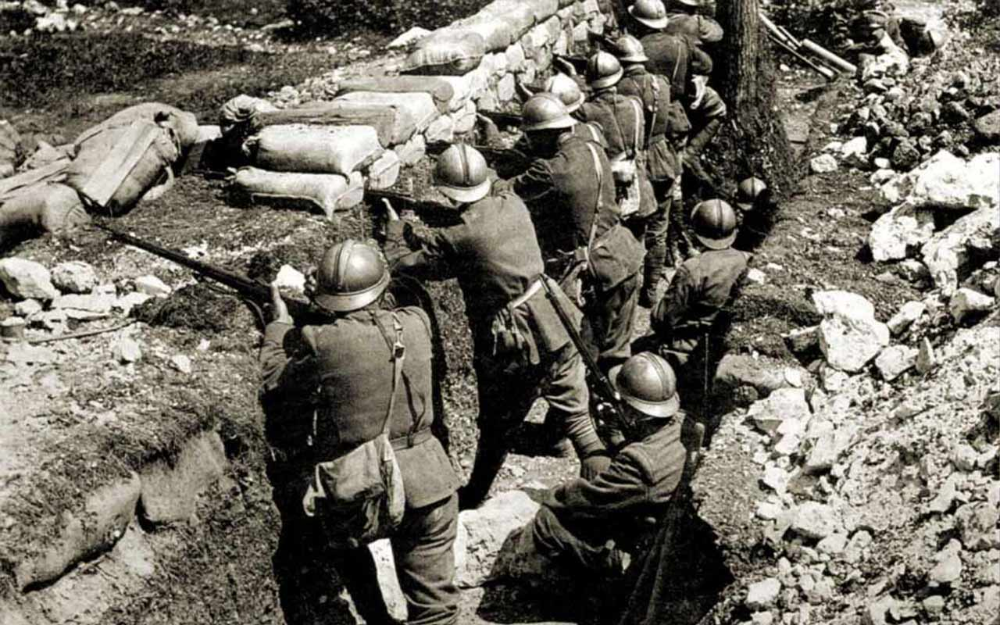

# Prima guerra mondiale

La prima guerra mondiale fu un conflitto che coinvolse le principali potenze e molte di quelle minori tra il 28 luglio 1914 e l'11 novembre 1918. Inizialmente definita "guerra europea" dai contemporanei, con il coinvolgimento successivo delle colonie dell'Impero britannico e di altri Paesi extraeuropei, tra cui gli Stati Uniti d'America e l'Impero giapponese, prese poi il nome di guerra mondiale o Grande guerra: fu infatti il più grande conflitto armato mai combattuto fino alla successiva seconda guerra mondiale.

Il conflitto ebbe inizio il 28 luglio 1914 con la dichiarazione di guerra dell'Impero austro-ungarico al Regno di Serbia in seguito all'assassinio dell'arciduca ed erede al trono Francesco Ferdinando e sua moglie Sofia, avvenuto il 28 giugno 1914 a Sarajevo per mano di Gavrilo Princip, studente bosniaco facente parte della Mano Nera.

